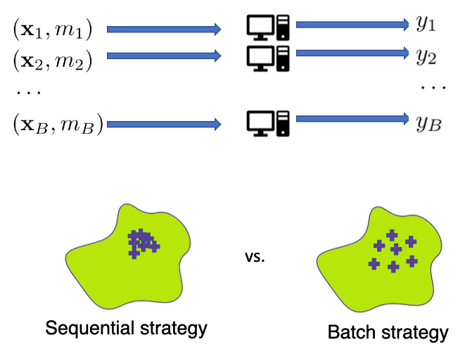
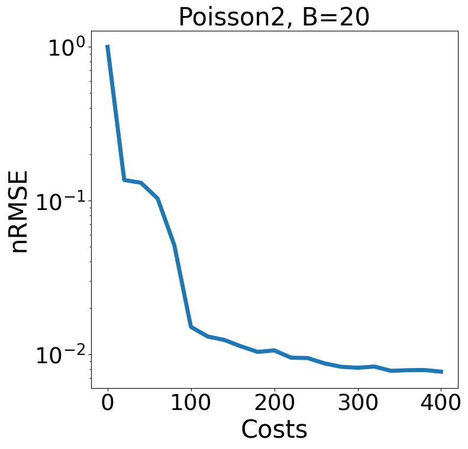

# *BMFAL-BC*: Batch Multi-Fidelity Active Learning with Budget Constraints

by [Shibo Li*](https://imshibo.com), [Jeff M. Phillips*](https://www.cs.utah.edu/~jeffp/), [Xin Yu](https://yuxwind.github.io/), [Mike Kirby](https://www.cs.utah.edu/~kirby/) and [Shandian Zhe](https://www.cs.utah.edu/~zhe/)

<p align="center">
    <br>
    
    <br>
<p>

<h4 align="center">
    <p>
        <a href="https://openreview.net/forum?id=MNQMy2MpbcO">Paper</a> |
        <a href="https://github.com/shib0li/BMFAL-BC/blob/main/images/slides.pdf">Slides</a> |
        <a href="https://github.com/shib0li/BMFAL-BC/blob/main/images/poster.pdf">Poster</a> 
    <p>
</h4>


Learning functions with high-dimensional outputs is critical in many applications, such as physical simulation and engineering design. However, collecting training examples for these applications is often costly, e.g., by running numerical solvers. The recent work (Li et al., 2022) proposes the first multi-fidelity active learning approach for high-dimensional outputs, which can acquire examples at different fidelities to reduce the cost while improving the learning performance. However,  this method only queries at one pair of fidelity and input at a time, and hence has a risk to bring in strongly correlated examples to reduce the learning efficiency. In this paper, we propose Batch Multi-Fidelity Active Learning with Budget Constraints (BMFAL-BC), which can promote the diversity of training examples to improve the benefit-cost ratio, while respecting a given budget constraint for batch queries. Hence, our method can be more practically useful. Specifically, we propose a novel batch acquisition function that measures the mutual information between a batch of multi-fidelity queries and the target function, so as to penalize highly correlated queries and encourages diversity. 
The optimization of the batch acquisition function is challenging in that it involves a combinatorial search over many fidelities while subject to the budget constraint. To address this challenge, we develop a weighted greedy algorithm that can sequentially identify each (fidelity, input) pair, while achieving a near $(1 - 1/e)$-approximation of the optimum. We show the advantage of our method in several computational physics and engineering applications. 

<!-- IFC-ODE $^2$ /GPT -->

# System Requirements

We highly recommend to use Docker to run our code. We have attached the docker build file `env.Dockerfile`. Or feel free to install the packages with pip/conda that could be found in the docker file.

# Datasets of Physical Simulations

You can generate other physical simulations datasets by yourself by running, for example,

```
python generate.py -domain=Poisson2 -Ntrain=[50,20] -Ntest=[100,100]

```
For *Buergers*, *Topology Optimization*, *NavierStock*, the solvers requires MATLAB support. The generated multi-fidelity data will saved in to `data/__processed__` folder


```
data/
├── __processed__/
│   └── Poisson2/
│       └──...
│   └── TopOpt/
│       └──...
│   └── ...
├── (matlab_solvers)
```


# Test Example

You can fast test on *Poisson2* equation by run
```
bash experiment.sh
```
for  epochs, the testing nRMSE on the target fidelity with respect to the acculuated costs are ploted

<p align="center">
    <br>
    
    <br>
<p>


# License

BMFAL-BC is released under the MIT License, please refer the LICENSE for details

# Getting Involved
Feel free to submit Github issues or pull requests. Welcome to contribute to our project!

To contact us, never hestitate to send an email to `shibo@cs.utah.edu` or `shiboli.cs@gmail.com` 
<br></br>


# Citation
Please cite our paper if you find it helpful :)

```

@inproceedings{
li2022batch,
title={Batch Multi-Fidelity Active Learning with Budget Constraints},
author={Shibo Li and Jeff Phillips and Xin Yu and Robert Kirby and Shandian Zhe},
booktitle={Advances in Neural Information Processing Systems},
editor={Alice H. Oh and Alekh Agarwal and Danielle Belgrave and Kyunghyun Cho},
year={2022},
url={https://openreview.net/forum?id=MNQMy2MpbcO}
}

```
<br></br>
